# Introduction

I’m Jordan and I’m a system administrator. That means I get to do a lot of exciting things; jack of all trades, master of none, or whatever you may call it. Sometimes that allows me to go down some rabbit holes, then ends of which can be incredibly fascinating, and inform decisions I make when protecting the company systems architecture now and into the future.


## Playing with new technologies and poking malware 

This week, I poked and prodded at a malware sample that landed on the network on Monday, November 7th. This sample was quickly detected by our EDR (Endpoint Detection and Response) solution. It was our first real malware incident since purchasing new EDR software that was capable of discovering threats in real time, with features like behavioral analysis and AI confidence models to classify suspicious and malicious threats. 

This would have not been detected by legacy, scanning based antivirus software. I’ll show you more as to why as we dissect this sample and try to figure out as much as we can about it. It’s exciting stuff, and it will aid in your understanding of how these new systems work. 

Fundamentally, I believe understanding how computer systems function is the key to better protecting them, maintaining them, and serving those who use them. I hope you’ll take away a desire to try this yourself and better learn how to protect your own networks. 


## Business Value

Additionally, you can show business value in dollars that EDR solutions provide. It is also important to show value once the solution is implemented. That’s why when you have a malware incident with something more striking than your run of the mill adware, something like a botnet that can drill into your network, you need to take more interest. Something like Bumblebee Loader which deposits initial access to ransomware groups. Once something like this is on your network undetected, it is only a matter of time until your files are locked up and a ransom is demanded (in some cases, just days). 

Anyway, I’m not sure if this sample is related to Bumblebee, because I’m relatively new to malware analysis and threat intelligence stuff. I’ve done security for a while, but this is pretty specific. I am no expert. I’d like to actually get this sample to some researchers, as I want to know and learn more.

**Quick bullet point rant and disclaimers**


* Don’t run this stuff on your machine you use every day. 
* Set up a lab please, for the love of God. 
* Don’t put that machine on the same network either. Ideally you can have a different subnet or interface on the firewall. You just don’t want a threat actor moving laterally into your PC, right?
* If you haven’t understood a word of what I’ve written so far, it would be a good idea for you to not run malware intentionally at all. Live vicariously through me. Thanks for reading though 🙂

Let’s jump into it.


## Lab Setup

My lab setup is pretty basic. A lot of this journey was setting up the lab and learning how to get logging working so I could see what the malware is doing. Most malware analysis is done via sandboxes. I used a sandbox to investigate the malware the day and week that it was detected.

The next week, I set up a physical machine that was attached to a network with no other machines on it. This network was on a separate network than the production company network, with its own independent firewall, and even public IP address.

[[Insert diagram here]]


## Tools

Below is a list of tools during each analysis I did.


### Sandbox Analysis


* FlareVM - This is a solution from Mandiant to turn any machine into a malware investigation sandbox. Maybe I’ll do a setup tutorial sometime.
* Sysinternals Tools
    * Process Monitor 
    * Process Explorer
* Ghidra (you can use other tools, I just wanted to see what this what all about)


### Live analysis


* Snort3 - For packet sniffing and logging
* Splunk - For storing logs and data 
* Sysinternals
    * Sysmon
* Windows Event Logging - Cranked it up


# Basics of Malware Analysis

When malware gets loaded on a machine, it needs to run itself, hide itself, and establish a base where it can operate. This will allow the attacker to log in later with their hands on a keyboard, and issue commands to the PC. Once this occurs more malware can be downloaded, leading to different types of attacks and scenarios, based on the threat group your machine fell victim to. Some do ransomware, some do data exfiltration, some steal company secrets. You never know, so treat all with the highest care. Don’t run malware on your daily driver machine please, just to reiterate.

Readers will need to look to other resources to understand some of the things I mention here more in depth. I will do my best to translate to simpler terms that can be understood by most folks. In saying that, if you wanted to do something like this accurately, you should look to other, more authoritative resources to get better at this skill. I’ll mention some I used later. I’m still learning. 

This post will be just a walkthrough explaining my thought process and the tools I used to identify the malware I found on the network that Monday morning. With that, I was able to communicate to leaders the value of our detection solution.


# Walkthrough


### Malware Delivery

The malware came in via a targeted phishing email.

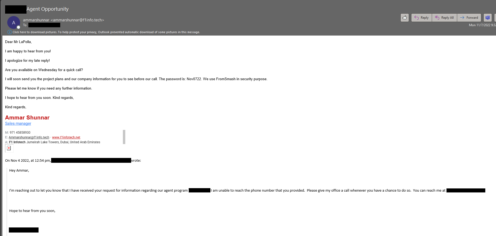

It led to a link to a service to download a password protected ZIP file.


A couple things to note so far:


* Since this was sent through a legitimate link, this malware bypassed two layers of spam filters and scanning.
* The file was password protected, thus thwarting a scan of the file by tools like pattern based antivirus

 


### Dissecting the File

Let’s check out this .img file

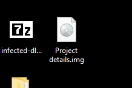

Let’s look at the files that it contains

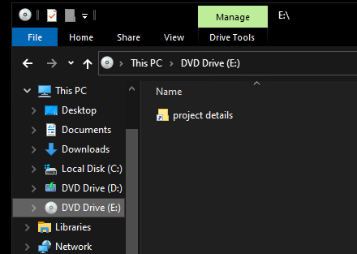

Only a .LNK file? I don’t buy that. Let’s look closer. We need to view hidden items

There we go!

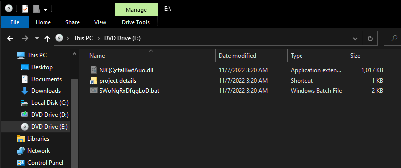

Looks like there are three files total in this .img file.


1. NJQQctalBwtAuo[.]dll
2. SWoNqRxDfggLoD[.]bat
3. project details[.]lnk

The threat actor definitely wants the user to click on the shortcut file. Let’s pop it open to see what it does.

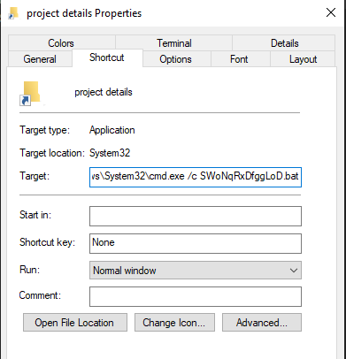

Looks like this command runs SWoNqRxDfggLoD[.]bat in a command window.

> A .BAT file is a batch file. It contains commands that can be executed by the Windows command line

Let’s check out what the .BAT file contains

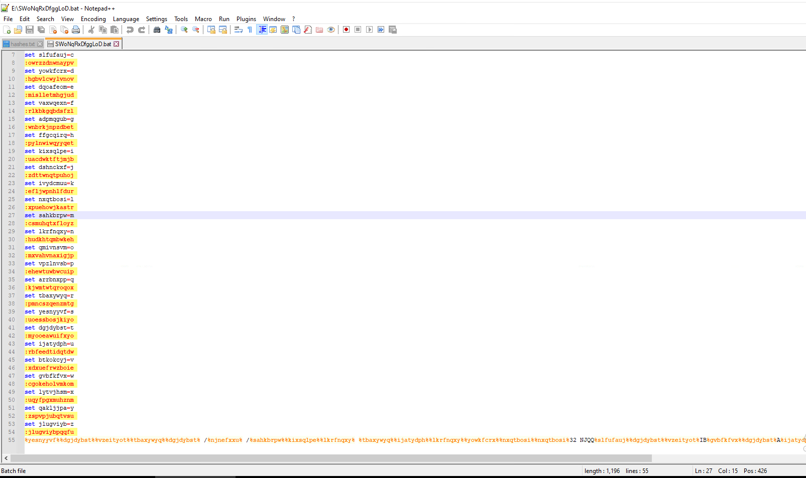

It’s heavily obfuscated, but not too hard to decipher.

The command at the bottom takes the form of this. Percent signs between strings of numbers. In the above photo, you can see each value is assigned a letter. Looks like you just have to translate each %% delimited string to get the command it launches.

```cmd

%yesnyyvf%%dgjdybst%%vzeityot%%tbaxywyq%%dgjdybst% /%njnefxxu%

```

It’s a puzzle! 

I’ve already translated it, but the cool thing is that there is more than one way we can get the unobfuscated command. I’ll show that to you later.

Here’s the command: 

```cmd

 rundll32.exe NJQQctalBwtAuo[.]dll,csvcrun

```

So there’s the malicious code, packed into that DLL file. Here’s where things get a little deeper, so just hang on. 

You can investigate the dll file using tools like Ghidra and IDA Pro. I used Ghidra because it is free. Let’s decompile this and look at some exports.

> DLL files are Dynamic-Link libraries. Think of them as shared code files. If I wrote a program for windows, I would use a DLL to access Windows network functions, etc.

> DLLs are similar to EXE files. The difference is DLLs contain an export table. Exports are the functions that are meant to be accessed and used by other programs. DLLs can also call other DLLs, and often do.

Let’s take a peek into this DLL

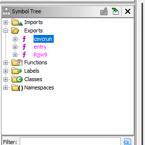

We can see that it contains 3 exports.


1. Csvcrun - This is the one that is executed by the .bat file. Interesting
2. entry - every DLL has an entry export
3. Rjjw9 - A function that seems to be called internally from the DLL. Looks like it has a lot of parameters

Let’s look at a disassembled version of the csvcrun function


This is about where my knowledge stops. We’ve made a lot of good progress looking at the structure of this thing.


### What we know so far

This is a heavily obfuscated, dropper. Csvcrun is initially launched, but once some criteria is met, Rjjw9 will be called.


### Let’s do it live

I created a network just to run this malware on. We are able to see much more of what this malware does when it is running. 


* I use Snort3 to catch all traffic from my infected host and all traffic to my infected host.
* I use Sysmon to catch created processes, DNS queries, and other events of interest.
* I use Windows logging to catch events generally. Specifically the malware archaeology guide. 
* I use Splunk to gather all this data and search through it.

I may do tutorials for how I configured and set these things up, but for now I’ll leave that out. We’ll see.

Anyway, let’s detonate some malware.


### Process Monitor

Process monitor allows you to track file, registry, process and thread, and network changes by programs. We’ll launch it before we launch the malware to catch what it does to our system.

Process monitor isn’t super useful here, as in the lab environment the malware does not proceed past attempting to talk out to the command and control servers, or other bots. We’ll examine what happened on the initial infection endpoint to get an idea of what else it can do.


### Process Explorer

We’re going to use Process Explorer from sysinternals to monitor what happens when this program is run. You’ll be able to see when it starts. 

Double click the lnk file

Here it is in process explorer


Double clicking the process will bring up its properties. Let’s see what’s in there.

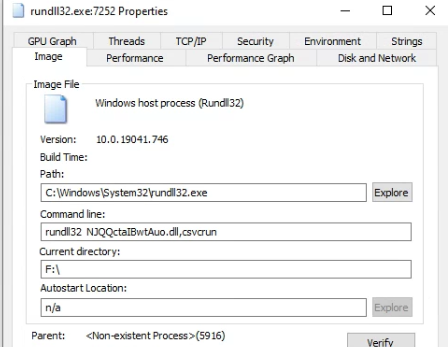

Now let’s check the network tab for activity.

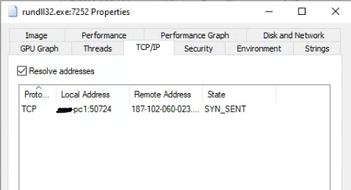

It is actually cycling through a list of IP addresses that seem to be hard coded into that DLL. I let it run for its full cycle and generated a whole list of addresses this malware reaches out to.


### Snort and Splunk

Let’s look at some of the network traffic. I’ll spare you the details of setting up stuff. Let’s look at occurrences from the time I ran the malware to 20 minutes later when it repeated the same loop.

With Snort, we can look at the network traffic

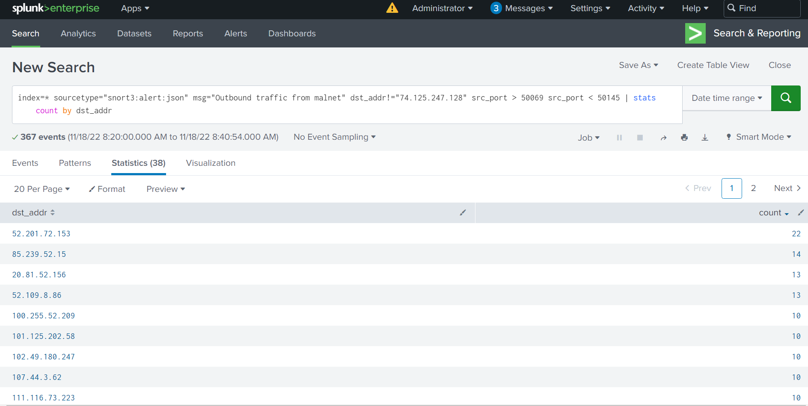

With Splunk and Sysmon, we can see when the process was launched. Similar info to what we saw in process explorer.

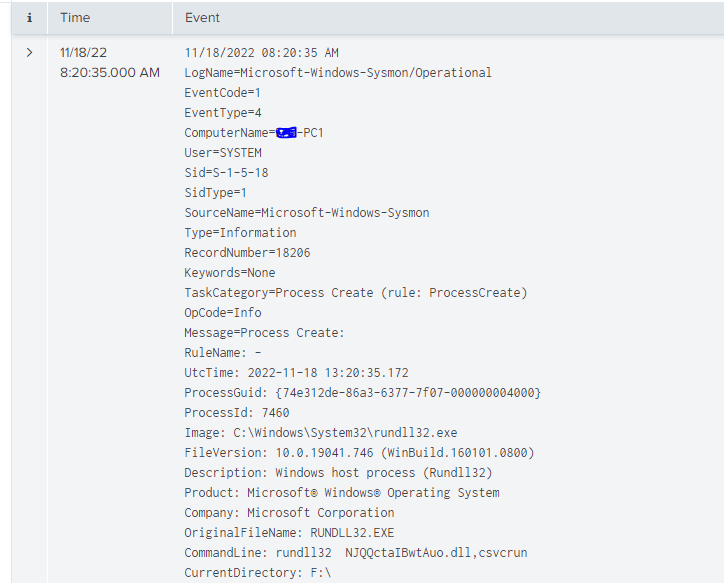

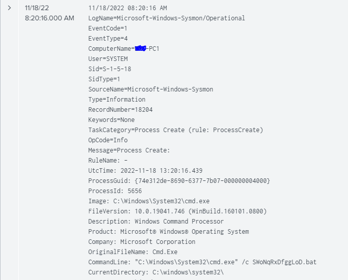

## Thoughts

This is about as far as I’ve made it in the malware analysis process. I could go further, but I don’t think I’ll gain much from it. With all the evidence I gathered through the walkthrough above, I was able to search the internet for some possible scenarios. Threat actors use similar techniques, tactics, and procedures, so I can assume some general things about this malware.


* It will embed itself in my system and wait for commands
* It will download other malicious software later in the process
* It is not good to have on a corporate network

Here are some links to articles I read with similar indicators

[https://www.cybereason.com/blog/threat-analysis-report-bumblebee-loader-the-high-road-to-enterprise-domain-control](https://www.cybereason.com/blog/threat-analysis-report-bumblebee-loader-the-high-road-to-enterprise-domain-control)

[https://www.proofpoint.com/us/blog/threat-insight/bumblebee-is-still-transforming](https://www.proofpoint.com/us/blog/threat-insight/bumblebee-is-still-transforming)

In our case, we took the infected machine and re-imaged it. This malware did more on that endpoint than it did in my lab so far, so we will investigate those logs in the next section.

Anyway, imagine with me this attack had not been stopped. Imagine that it locked up the whole business after 3 days of network dwell time.

The cost of proper protection and expertise is far cheaper than cleaning up an incident of that magnitude. Worse yet, if you aren’t monitoring, you won’t even pick up on something like this occurring.

## EDR Detection
<br> 
Below is the link diagram from the original BAT file launch to a wab.exe process that was maliciously launched by the DLL.

This did not occur on my lab machine, as I assume the unique code in the header associates with one IP address. Like I said earlier, I am new to this.


# Conclusion

I'd say if you are an admin looking for something to do, this is a good exercise to familiarize yourself with how malicious programs operate. Further than that, these tools allow you to troubleshoot misbehaving functionality of any application. 

Analyzing things like this is both an art and a science. If you do it enough, you'll start to notice patterns, like what is normal, what is not normal, etc. 

I'm open to any communications, if I did something incorrectly or made an error please let me know. I want to keep learning!

Thanks for reading.